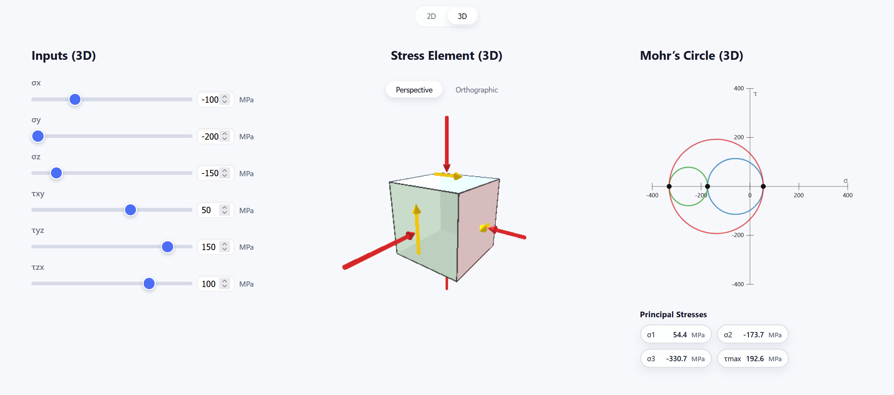

# Mohr’s Circle Visualizer

Simple web app to visualize Mohr’s circle in 2D and 3D.

## Features
- 2D Mohr’s circle with interactive stress element
- 3D stress element with p5.js (WebGL) and a 3D Mohr’s circle view
- Live inputs for stress components (MPa)

## Previews
### 2D


### 3D


## Run locally
```bash
npm install
npm run dev
```

Open http://localhost:3000
